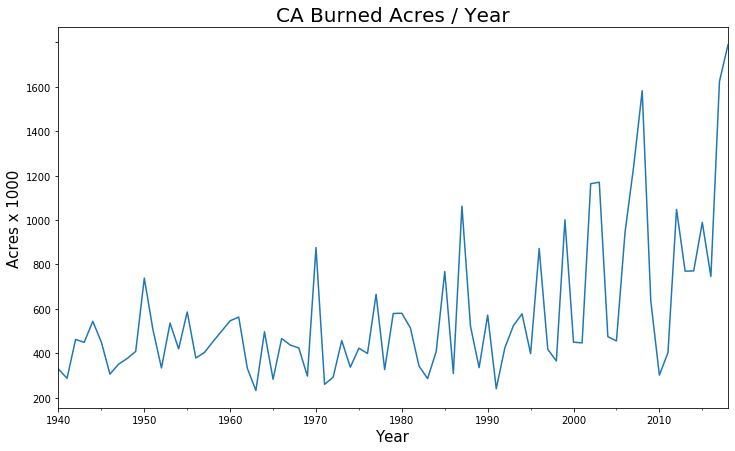

## California Wildfire Timeseries | 1940 - 2018

This gif was made using QGIS and the Time Manager Plugin. 

To complement the gifs, I plotted various statistics per year, showing a general increase in fire frequency, land-area impacts, and mega-fire size.

### Data
The original data was ammended slightly with QGIS, and from Cal Fire (formerly available [here](https://frap.fire.ca.gov/data/frapgisdata-sw-fireperimeters_download) ). Hopefully it will return to this web location.

The vector layers are available as a shapefile in the project repo.

The data depicts all historical CA fires from 1878 to 2018, including severe notable fires from 2018 (Camp Fire, Carr Fire, Mendocino Complex Fire).

